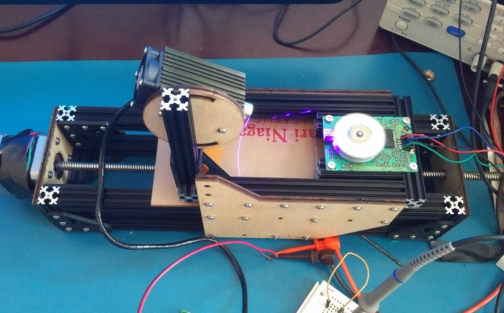
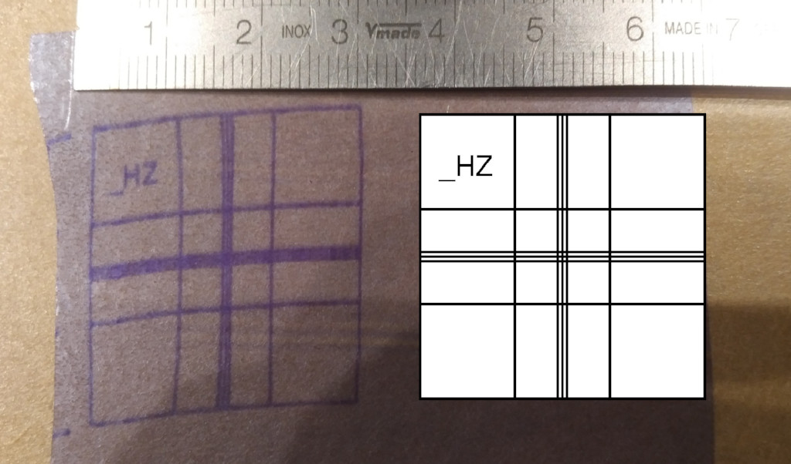

LDgraphy - Laser Direct Lithography
===================================

Or Laser Direct Imaging, whatever you prefer.

(work in progress, nothing to see here yet)

Simple implementation of direct photo resist exposure using a 405nm laser.

Uses
  * 500mW 405nm laser
  * Commonly available polygon mirror scanner (from laser printers)
  * stepper motor for linear axis.
  * Beaglebone Black to control it all (using the PRU to generate precise
    timings for mirror and laser).
  * Possibly later some simpler set-up with Cortex M4 or so.

Build
-----
```
git clone --recursive https://github.com/hzeller/ldgraphy.git
```

Install relevant packages. We are reading images as input, so we need a library
that helps us with that:
```
sudo apt-get update
sudo apt-get install libgraphicsmagick++-dev libwebp-dev -y
```

Then compile:
```
cd ldgraphy/src
make
```

Usage:
```
Usage:
./ldgraphy [options] <image-file>
Options:
        -d <val>   : DPI of input image. Default 600
        -i         : Inverse image: black becomes laser on
        -M         : Inhibit move in x direction
        -F         : Run a focus round until the first Ctrl-C
        -n         : Dryrun. Do not do any scanning.
        -h         : This help
```

Case
----
There is [work-in-progress](./hardware) to make a case that does not need
extruded aluminum which was used for the first test, but rather a simple
laser-cut acrylic case.


This was the first experiment
-------------------------------

## First Light

   Setup               | Result
-----------------------|---------------------------------
   | 

Somewhat crappy first result, but has potential. Exposure time for this 30 mm
long patch was around 90 seconds.

(for reference: on the right is how the geometry _should_ look like).

There are a couple of known problems:

  * Focus: the focus of the laser is not optimized yet. The lens that is mounted
    to the laser is pretty fiddely and wobbles around a lot in its socket. That
    needs to be fixed before real PCB exposure.
  * Distortion: Looks like there was some initial distortion due to mirror
    timing that got better over time. I suspect the slow speed I am driving
    the mirror (250 lines/s) makes the its PLL unhappy and creates some drift
    initially.
    (I can't drive it much faster right now as that will give
    bandwidth trouble in the laser. Probably this means the laser driver needs
    to be redone).
  * I am missing a ACME nut for my X-axis: the sled was pulled with
    shapelock-formed nut, pulled on some electric tape :). So, uhm, that needs
    improvement.

So, given the known problems and this was essentially the first run with the
initial software, this is not _too_ bad.