LDGraphy design overview
========================

### Theory

At its core, LDGraphy is a switched laser, a rotating mirror that
moves the dot in a scan-line and a sled that moves the photoresist-coated PCB
forward.

Laser scanning is very simple and cheap to do with common components these
days. Lasers with a wavelength of 405nm (which is close to the peak-sensitivy
of dry-film photoresist) can be found cheaply with around 500mW power.

As for scanning, there are several techniques. A common one is to have a mirror
that rotates to deflect a laser. Since it would take a while for a mirror
to turn around full 360° after a segment is scanned, they come as
a polygon mirror: a polygon that has mirror-reflective edges.
A typical mirror that is used in Laser printers 6 sides; you notice that
the actual mirror face is not that high - but we only need to deflect a laser dot.

|    Top                      | Side
|-----------------------------|-------------------------------
| 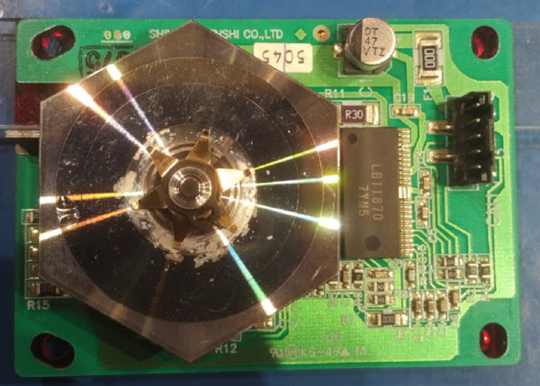  | 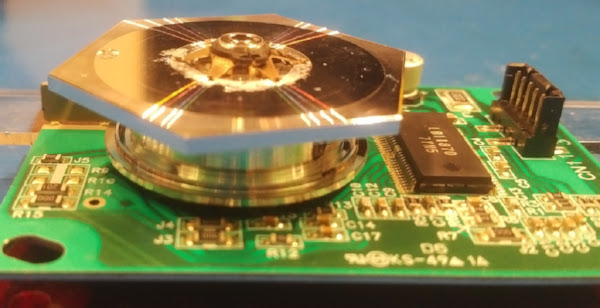

With this hexagon, we can project a 120° arc (each mirror
face is 60°, so the angle between incident ray and reflected ray is 120°).

Here, we just shine (a fast blinking) laser at an angle from the top, it is
reflected at the rotating mirror and projected downwards.
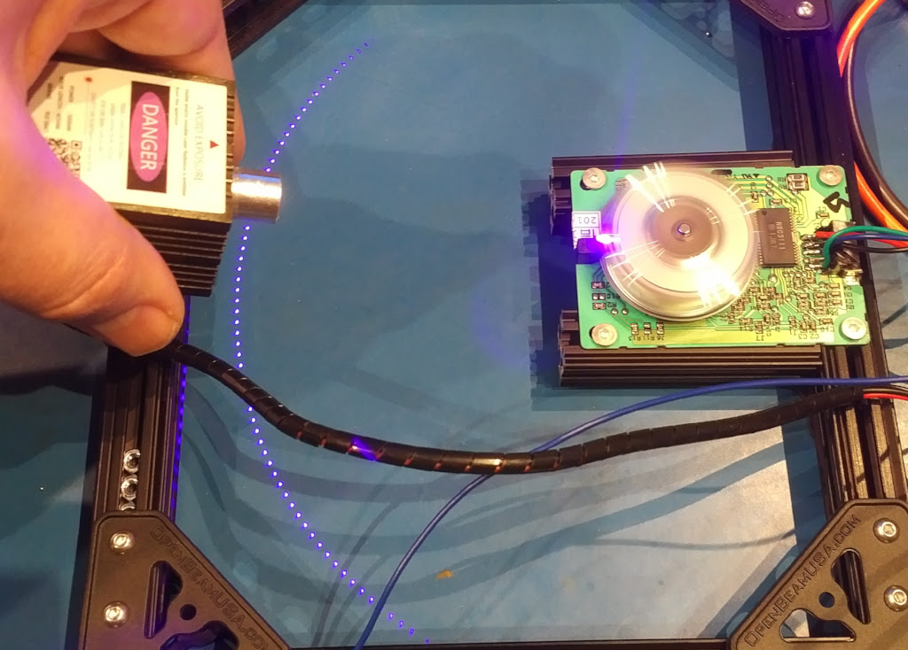

#### Direct angled arc exposure
We can make a scanning device with this simple set-up if we correct for the
arc distortion in software; in fact, in an early experiment for LDGraphy
I was doing exactly that:

[![Early experiment][early-experiment]][arc-project-vid]

There are advantages for this set-up: we can utilize a large fraction of the
laser on-time by covering the majority of the available scan range.
The scanning laser is "almost" in focus for the scan range where it hits
the board.

This is a simulation of such a scanning in which we use 105° out of 120°
(the laser is off only for 15 degrees). We can see that the laser dot is oval
in the extreme angles but also even in the center. This is because the actual
focal plane of the laser (indicated with a gray circle at the sharpest focus)
is hitting the surface at an angle, resulting in an oval exposure.

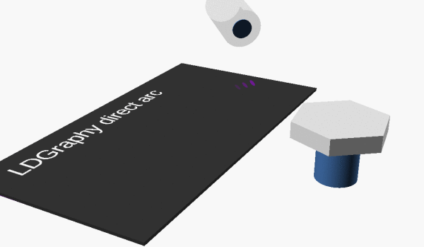

This set-up is very simple to build, but the oval exposure dot is an issue.
Also it is very sensitive to angle variations: just small changes in the
shallow angle moves the projected arc-line forward and backwards.

#### Cone mirror arc exposure
This could be fixed, if we had a mirror that points the laser-arc downwards, so
that it hits the resist perpendicularly and is also always in focus.
The mirror would need to be a circular segment with a downwards
angle -- essentially a segment of
an inner slice of a cone. Now we hit the photo resist always at a sharp
focus point, even for the wide scan angle of 105 degrees as the geometry
keeps the focal plane of the laser exactly on the exposed surface.

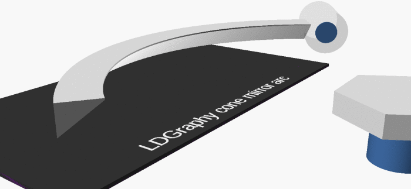

However, making custom mirrors in such a shape at home is not really feasible
(Someone who has access to a lathe: this would essentially be a 45° bevel
on the inside of a large diameter stainless steel pipe with a wall thickness
of about 2-3mm. Then mirror finish polishing this bevel. I don't have
access to a lathe though :/).

We want to build this machine with minimal accessible tools, so this
is a hurdle.

#### Straight mirror line exposure
We can simplify and use a straight mirror to project downwards to get a line.
However, the focus point then is of course not always in the plane of the
photo sensitive material. In particular if we cover a large scan angle, the
focus variants are significant.

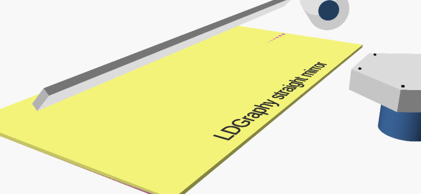

The exposure point now is very large at the fringes. We could alleviate some of
it by "plunging" the focus plane below the surface at the center, but it will
still be too much of a variant.

The advantages for the home-build is, that this works with a very simple straight
mirror (easy to come by with) and does not have the problem of being sensitive
to the shallow angle variations like the angled direct arc exposure.

The issue though is the focus, even more pronounced than in the direct arc scan.

#### F-Theta lens corrected line exposure
In professional scanning applications, a so-called [f-theta lens][f-theta-images]
is used to keep a straightly projected laser dot always focused to a plane.

If you take apart a laser printer, you will see a lens set in the
laser assembly: that is the f-theta lens.

However, this is also somewhat out of reach for the hobbyist to make (though
I still consider to try making one with transparent acrylic). It also does not
seem to be available as off-the-shelf part like the Polygon mirrors and the laser
does (you can get them, but they are very expensive).

If you find some, it is probably meant for a laser printer and optimized for
infrared light not UV light.

What else can we do ?

#### Straight mirror line exposure with small throw

If we choose to do the straight projection, but only use the 'center piece'
and limit ourselves to a smaller angle, the focus variation is not _that_ much
and we get an acceptable compromise in exposure dot size.

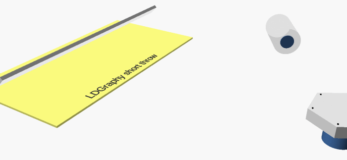

We don't need any special mirror or lens. The disadvantage is, that we only
can use part of the time of the laser: if we use 40° scanning out
of 120°, we only use the laser for 1/3 of the time (you see the laser is
dark for a long period in the illustration). Also, we need much more space as
we need to be further away to cover the same PCB width.

### Design Options Review
Let's review our options

   * Angled direct arc exposure
     mirror:
       * :thumbsup: fewest parts needed; almost full use of the laser; No light losses.
       * :thumbsdown: focus plane intersects with exposed board at an angle creating oval dots; susceptible to small angle changes; large build.

   * Cone mirror arc exposure
       * :thumbsup: almost full use of laser; no light losses; hitting resist
       	  perpendicularly; always in focus; very compact.
       * :thumbsdown: Requires to build a custom shaped mirror.

   * Straight mirror line exposure with _large_ throw
       * :thumbsup: easy to build; very compact.
       * :thumbsdown: very noticeable focus issues in far angels.

   * F-Theta lens corrected line exposure
       * :thumbsup: Almost full use of the laser; hitting resist perpendicularly; always in focus.
       * :thumbsdown: Requires to build a custom shaped lens; might have optical
         losses in the material.

   * Straight mirror line exposure with _small_ throw
       * :thumbsup: easy to build; focus issues less pronounced than with
          large throw.
       * :thumbsdown: need longer exposure time; large build.

Overall, the most promising is the cone mirror solution: it creates sharp focus
points, makes good use of the laser time and building a custom mirror
is somewhat more feasible than building a f-theta lens.

However, since ease-of-build for everyone with limited access to tools is a
priority, we start with the small throw line exposure for this first version
of LDGraphy - it doesn't require any manufacturing of a mirror and is a
good compromise.

### Practice

#### Scanning

This is how the current LDGraphy device looks like. From the top, we can
see all relevant components for the laser scanning:

|   Drawing                      | Reality
|--------------------------------|---------------------------------
|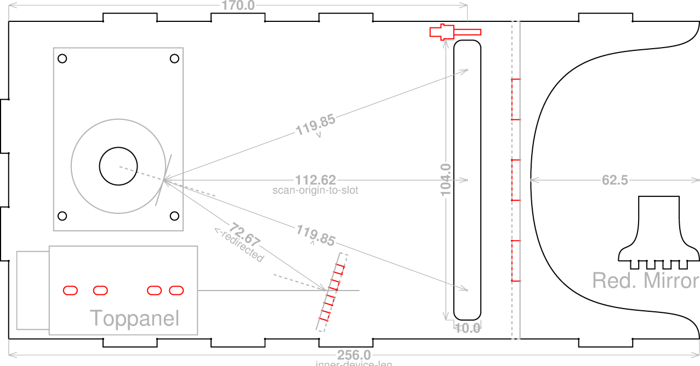[See full drawing here][hardware] | 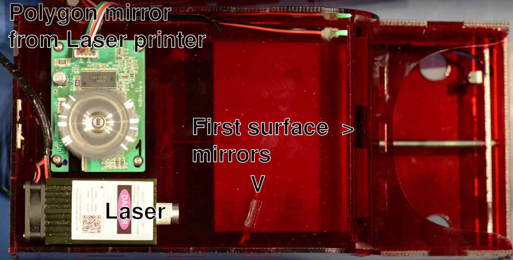

To keep things more compact, the laser is mounted in one corner and the light
is redirected onto the polygon mirror. But other than that, this is exactly
as discussed above. There is a long mirror on the side that is pointing
downwards, a little hard to see from above, so lets look from the back, with
some rough indication of the laser path:

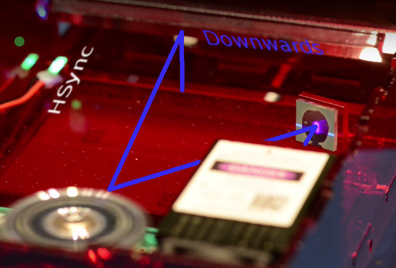

When the polygon mirror is rotating, the laser point passes through a slit onto
the surface to be exposed.

On the left, you see a fluorescing piece of material that has a photo diode
attached. This is our horizontal sync (HSync) to detect when a laser line starts.

##### Issues

There is an issue that I discovered with some cheap polygon mirrors: the six
mirror faces have a little variation and not being entirely parallel to the
rotating axis, so project lines up and down a little, depending on the face.
So what needs to be done is to have another sensor to count mirror faces, and
then correct for this after a calibration step in software.

#### Moving the sled

The sled is moved with a stepper motor and a threaded rod. This rod does not
need to be CNC quality ball-screw, a simple screw from the hardware store is
sufficient. Why ? We only need to move in one direction, so we don't care about
backlash issues.

Here is how the base looks like, housing the motor and the threaded rod. The rod
is 'mounted' to the shaft of the motor with a heatshrink tubing (and a little
expoxy butting these together). A nut is not directly mounted to the sled but
to a slab of acrylic. You also see both the limit-switches:

|   Just drive                   | .. with sled
|--------------------------------|---------------------------------
|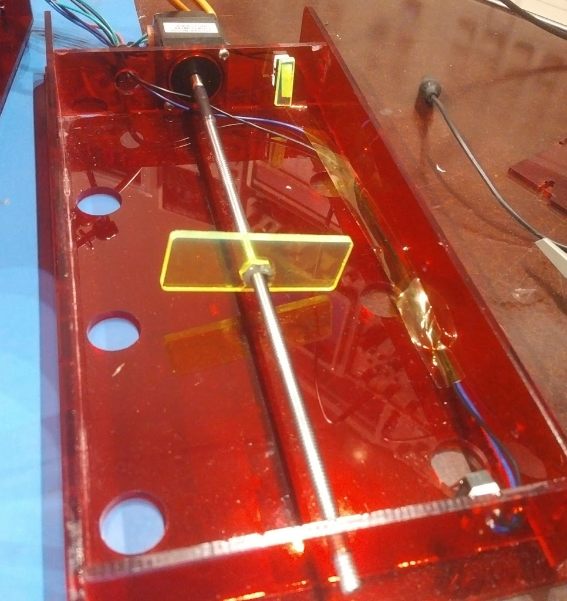 | 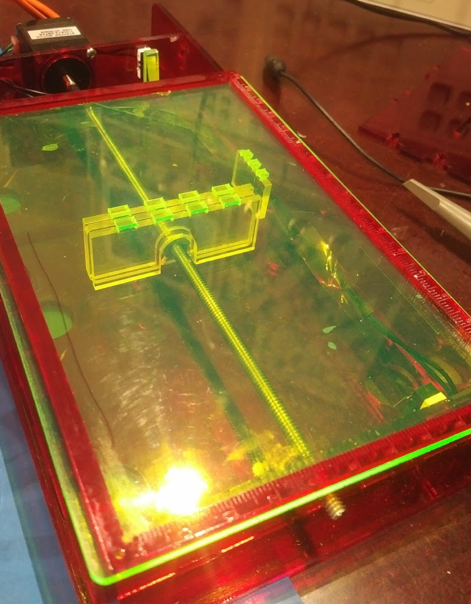

This allows us to have a separate sled that then sits on top of the moving
slab of acrylic. The design detail here is, that it allows to drive the sled
forward and backward, but has freedom to move in other directions: this can
be used to essentially be immune to 'wobble' from the cheap threaded rod.
In the current test version of LDGraphy, I have a horribly wobbling rod that
I found in a corner of my workshop.

You [see the wobble in the video :movie_camera:][ldgraphy-vid]; It still produces
acceptable quality

[![Resolution test][resolution-thumb]][resolution]

#### Electronics

Everything is controlled by a BeagleBone Black or Green. It has the nice property
that it is a common ARM machine running Linux (so offers the comfortable
environment of a full operating system including networking and can do all the
work like converting Gerbers and do image processing), but it also has
a built-in Programmable Realtime Unit (PRU) - a fast (200Mhz), independent
microcontroller essentially to help do the timing-accurate parts interfacing
the hardware.

We need this to accurately
generate the pulses to control the polygon mirror, switch on the Laser at the
right times (we have about 2Mhz pixel clock), and generally keep track of where
the laser is. And before you ask: of course, this could be done with an external
Cortex M4 or so, connected via SPI to some other computer (it would be more
expensive of course, but it works). I just had the BeagleBone lying around and
had used the PRU in a [previous project][beagleg].

The laser requires a current source, in our case it needs to be switched in the
low Mhz range. Some lasers (that you get from e.g. Aliexepress) already have a
"TTL driver", but they are utterly low frequency (50ish kHz), so this is why this
project needed its own [laser current driver] (not perfect yet, but works).

Right now, all the electronics is attached to the outside of the case, for easy
hacking and scope-probe access. Eventually, all these parts will
go inside the case.

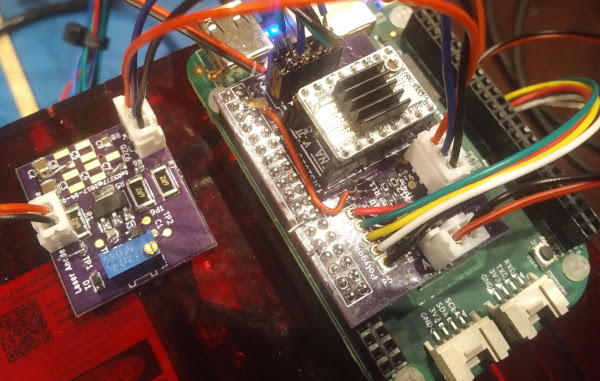

[resolution-thumb]: ./img/line-resolution-small.jpg
[resolution]: https://plus.google.com/u/0/+HennerZeller/posts/a8taHWeL5CC
[beagleg]: https://github.com/hzeller/beagleg
[Laser current driver]: ./pcb/laser-drive
[early-experiment]: ./img/arc-projection-vid.jpg
[arc-project-vid]: https://youtu.be/8tyT4CI-1io
[ldgraphy-vid]: https://youtu.be/G9-JK2Nc7w0
[hardware]: ./hardware#cut-pattern
[f-theta-images]: https://www.google.com/images?q=f+theta+lens