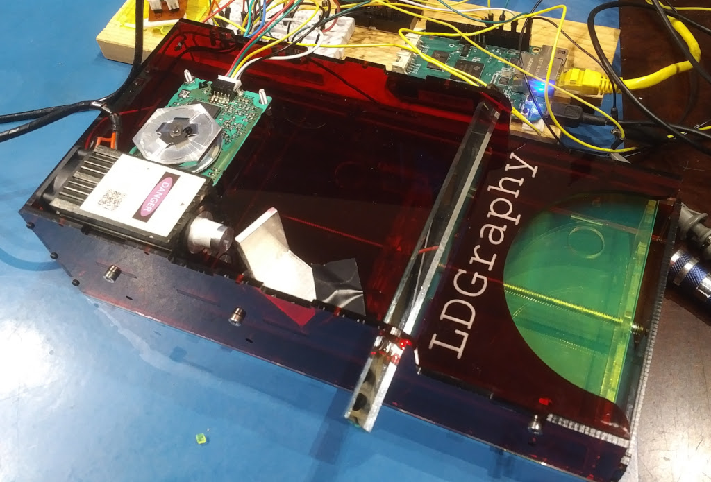
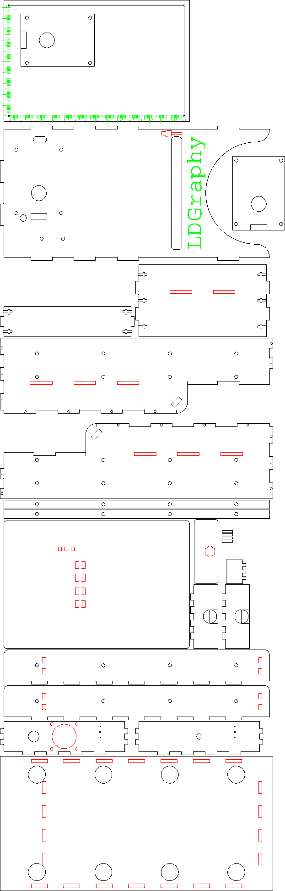

Casing
------

The [laser-cut-case.ps](./laser-cut-case.ps) PostScript file is a somewhat
parametrized source for making an acrylic case for LDGraphy.
Use black or dark-red acrylic to prevent the 405nm laser to escape in
eye-damaging levels.
You might see some pictures here that are transparent or open case for
illustrative purposes, and which are good engineering samples while developing (
and **require to wear Laser safety goggles**).
**Do not** use glass-clear transparent acrylic for the real machine, a 500mW
laser can blind you!

### How to cut
The file covers several parts, and depending on which you can fit
on your acrylic sheet and/or which you have to re-do, you can choose the ones
to be output in the first section that defines the
[`/print-...`](./laser-cut-case.ps#L4) boolean variables.

The Makefile can create a dxf file that is then usable in any laser cutter, just
call `make`.

There are several colored output layers that have different meaning for your
set-up in the laser cutter:
  * the 'black layer'. Cut with outward kerf correction (laser cuts outside).
  * the 'red layer'. Cut with inside kerf correction (laser cuts inside).
  * the 'green layer'. Set to engraving.
  * the 'gray layer' (if `/print-measures` true). Don't cut. Just FYI with measurements and help-lines.

### Note
This is pretty much work in progress, the drive and angle of laser mount etc.
are still beeing tweaked, there is no cover yet, or a place to mount the
BeagleBone.

