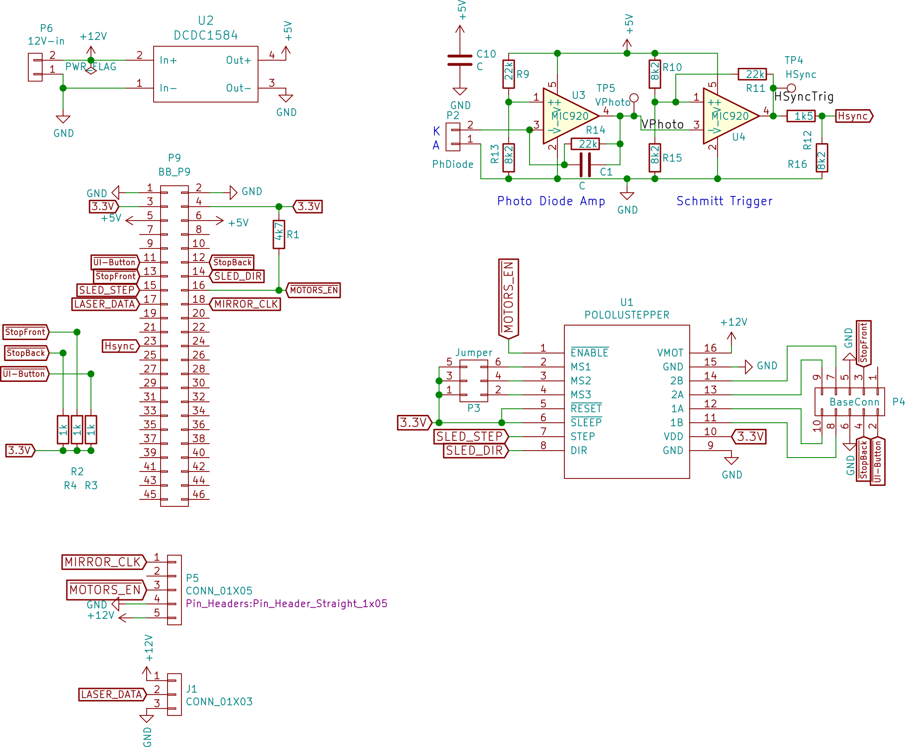

LDGraphy Beaglebone Black cape
==============================

This is for the experimental set-up. This is not meant to
be final, it focuses on easy measurement and mostly being a break-out for
connectors for other parts. The final board will have all the parts that are now
external modules integrated on one board.

  * Single 12V supply (uses a MP1584 based module to generate 5V supply for
    Beaglebone).
  * Inputs
     - Connector for photo diode used for the horizontal sync detection.
       Amplifier and Schmitt Trigger with fast OpAmps ([MIC920] datasheet)
       and steep enough slew-rate to generate acceptable output for digital
       inputs (also, same as used in the [laser driver](../laser-drive) to keep
       BOM small).
     - Two end-switches inputs.
     - One "user interface"-button input.
  * Outputs
     - Laser output connector for external [laser driver](../laser-drive).
     - Polygon mirror pulses and enable via 5-pin Polygon mirror connector.
     - Stepper motor (In this set-up: simply using a Pololu module)

(TODO: update schematic: there is now a cap accross R14)

[MIC920]: http://ww1.microchip.com/downloads/en/DeviceDoc/mic920.pdf