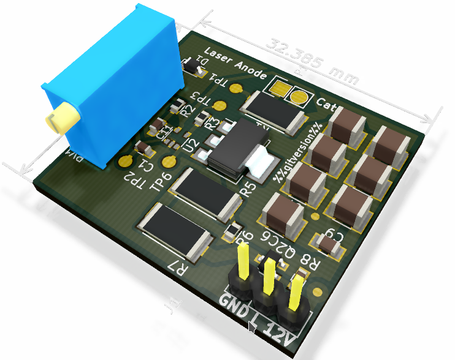

Laser Driver Board
===================

Laser driver board, a current source switchable with a TTL input. Place this
as close as possible to the Laser with short wires.

(TODO: update schematic: there is now a cap accross R3)

