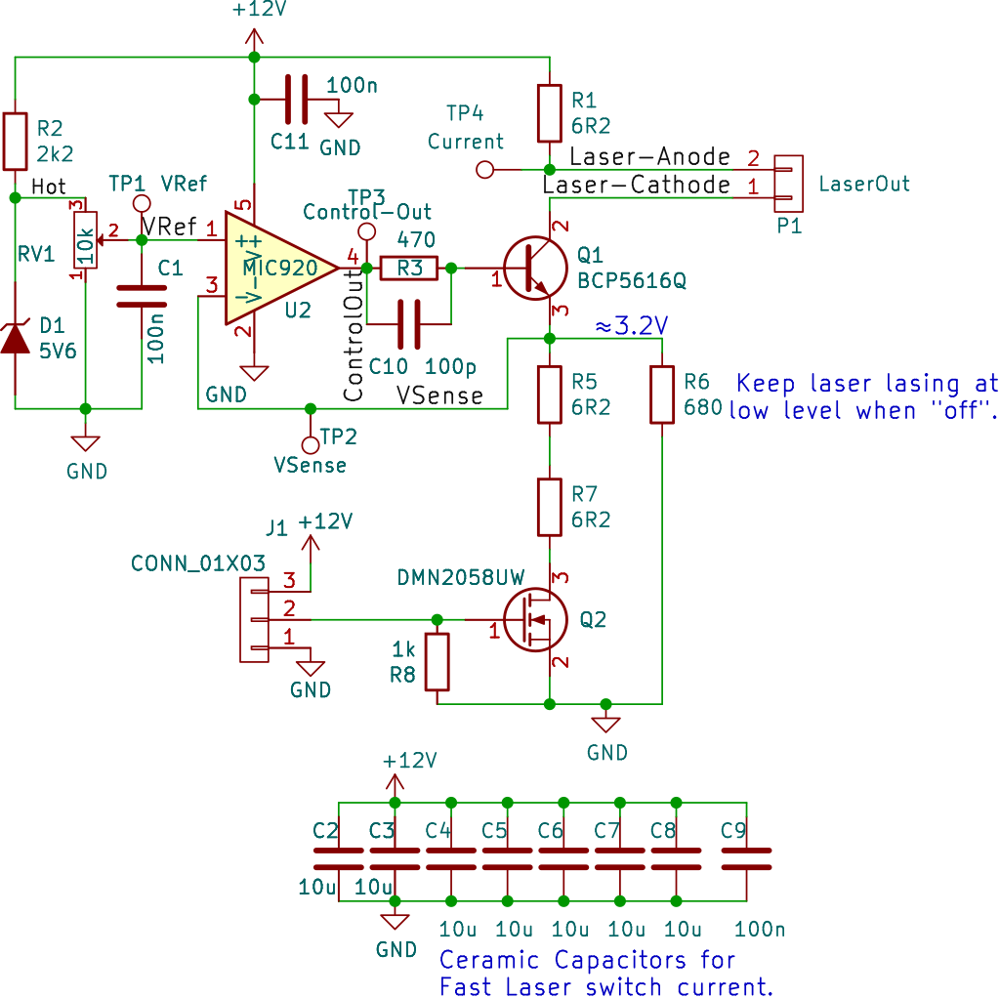

Laser Driver Board
===================

Laser driver board, a fast current source switchable with a TTL input. Place
this as close as possible to the Laser with short wires.

Choose `R1`, `R5` and `R7` to achieve desired target current for given laser
(`I ≈ (Vref - 0.6) / (R5+R7)`; Vref=0V..5.6V).

Adjust desired current by reference voltage with trimmer before connecting
laser. Measure current through laser via `(+12V - TP4) / R1`.

Depending on the inductivity of the supply line or desired current, not all
of the 10μ caps (C2..C8) might be needed.

### BOM

Qty | Reference(s)              |  Value    |   Footprint
----|---------------------------|-----------|-----------------------------
2   | C1, C11                   | 100n      | 0603
7   | C2, C3, C4, C5, C6, C7, C8| 10u       | 1210
1   | C9                        | 100n      | 0805
1   | C10                       | 100p      | 0603
1   | D1                        | 5V6 zener | SOD-323
1   | J1                        | CONN_01X03| JST_EH_B3B-EH-A_1x03_P2.50mm
1   | P1                        | LaserOut  | JST_EH_B2B-EH-A_1x02_P2.50mm
1   | Q1                        | BCP5616Q  | SOT-223-3
1   | Q2                        | DMN2058UW | SOT-323_SC-70
3   | R1, R5, R7                | 6R2       | 2512
1   | R2                        | 2k2       | 0603
1   | R3                        | 470       | 0603
1   | R6                        | 680       | 0603
1   | R8                        | 1k        | 0603
1   | RV1                       | 10k       | Multi-turn trimmer (through-hole, 2.54mm pitch)
1   | U2                        |  MIC920   | SOT-353_SC-70-5

There are probably better ways to have a fast current switching driver for
lasers that don't have a feedback line. Suggestions welcome.
