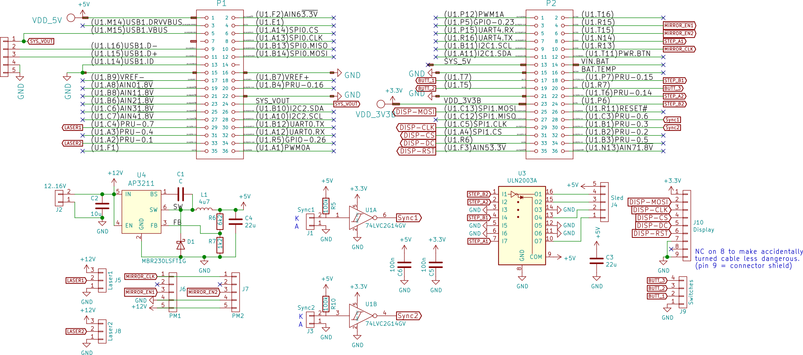

PocketBeagle LDGraphy cape
==========================

A cape for the PocketBeagle, that will allow to expose double-sided boards.

*Work in progress; won't yet work with the current software and case.*

Not only the software is not adapted yet, but this assume as motor
the 28BYJ-48, yet the acrylic case is still using the larger stepper.

So if you want to build something now, I suggest to use
the [experimental cape](../cape).

The board is packed with connectors; all of which are choosen in a way
that it very hard to connect to the wrong one:

| Designator | Type          | Description
|-----------:|:--------------|:---------------------
| J2         | 2p JST-XH     | Supply voltage. 12-16V
| J5, J8     | 3p JST-PH     | Laser1, Laser2 output
| J1, J3     | 2p JST-PH     | Laser1, Laser2 sync input
| J6, J7     | 5p 0.1" header| Polygon1, Polygon2 mirror
| J4         | 5p JST-XH     | Sled stepper 28BYJ-48
| J10        | 8p FFC 0.5mm  | Connector for 320x200 SPI display
| J9         | 4p JST-PH     | User-interface buttons
| J11        | USB           | USB connector for Wifi dongle

