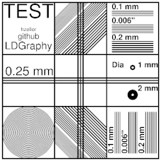
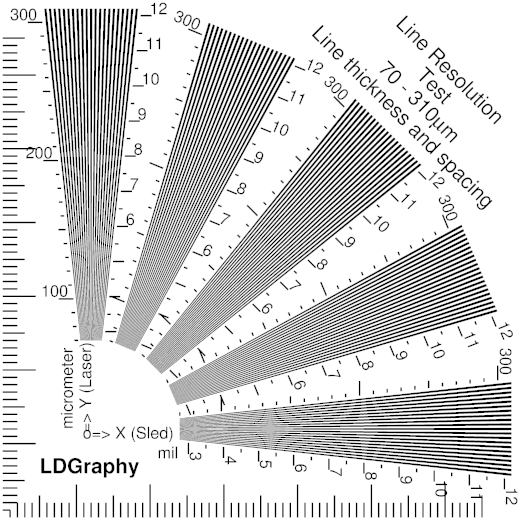
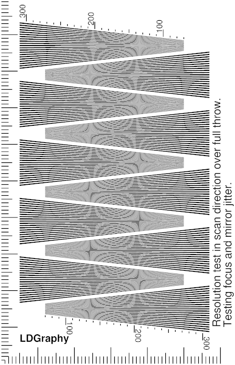

Test Patterns
=============
Various test-patterns used to calibrate and test the machine.
Postscript files, use Makefile to generate hi-res PNG that can be fed to
LDGraphy.

#### Low res examples

[test-pattern](./test-pattern.ps)

[line-resolution-test](./line-resolution-test.ps)

[scan-line-resolution-demo](./scan-line-resolution.ps)
